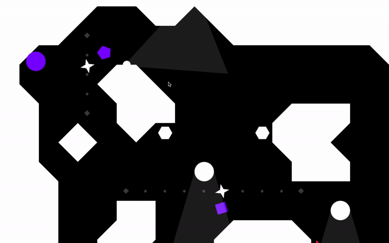
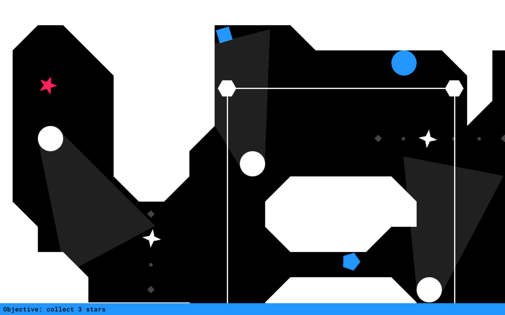

# sneaktime
 The bad guys are building something sinister. Your mission is to sneak into their base and destroy whatever technology they are hiding.

 When running in terminal (debug mode), you need to provide "-d" argument so the command would be: python3 main.py -d

